This is a [Next.js](https://nextjs.org/) project bootstrapped with [`create-next-app`](https://github.com/vercel/next.js/tree/canary/packages/create-next-app).

## Getting Started

First, run the development server:

```bash
npm run dev
# or
yarn dev
# or
pnpm dev
# or
bun dev
```

Open [http://localhost:3000](http://localhost:3000) with your browser to see the result.

You can start editing the page by modifying `app/page.tsx`. The page auto-updates as you edit the file.

This project uses [`next/font`](https://nextjs.org/docs/basic-features/font-optimization) to automatically optimize and load Inter, a custom Google Font.

## Laporan Praktikum

|  | Pemrograman Berbasis Framework 2025 |
|--|--|
| NIM |  2241720067|
| Nama |  Febby Mathelda Silvya Mooy |
| Kelas | TI - 3D |


### Praktikum 1

Melakukan instalasi 


Pertanyaan Praktikum 1 

1. Jelaskan kegunaan masing-masing dari Git, VS Code dan NodeJS yang telah Anda install pada sesi praktikum ini! 

Jawab:

- Git adalah sebuah sistem kontrol versi yang digunakan untuk mengelola perubahan kode pada repository

- VS Code adalah editor kode ringan dengan fitur canggih seperti sebugging, ekstensi, dan integrasi Git untuk pengembangan software

- Node.js adalah runtime JavaScript yang memungkinkan eksekusi kode diluar browser, digunakan untuk backend, server, dan alat pengembangan seperti npm.


2. Buktikan dengan screenshoot yang menunjukkan bahwa masing-masing tools tersebut 
telah berhasil terinstall di perangkat Anda!

Jawab:

Node js

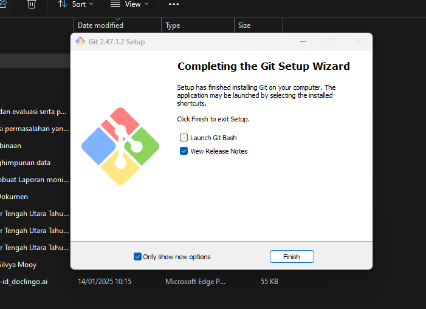

## Praktikum 2: Membuat Proyek Pertama React Menggunakan Next.js

1. Membuat folder proyek baru dengan nama belajar-react. Melalui konsol/command 
prompt/CMD masuk ke dalam folder tersebut dan jalankan perintah ini: 
npx create-next-app

2. Buat proyek baru dengan nama hello-world seperti di bawah ini. Nama proyek ini perlu 
dimasukkan pertama kali melalui konsol. 

Hasil:

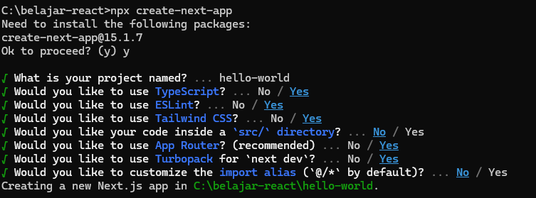

3. Buka folder proyek hello-world menggunakan VS Code. Masuk ke dalam folder proyek hello
world dengan perintah: 
cd hello-world 
Kemudian setelah masuk ke folder hello-world, masukkan perintah: 
code . 
Maka VS Code akan membuka project react Anda yang telah dibuat bernama hello-world. 
Dan akan menampilkan struktur folder proyek seperti di bawah ini.

Hasil:

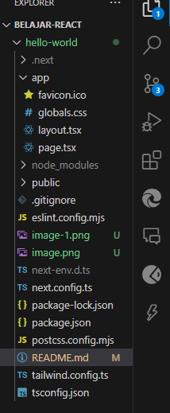

4. Running proyek hello-world dengan memasukkan perintah di bawah ini melalui konsol atau 
terminal di dalam VS Code. 
npm run dev

Hasil:

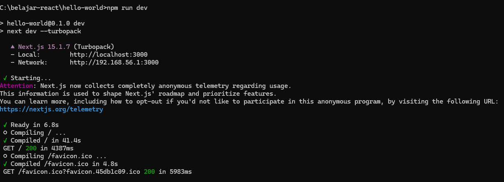

Pertanyaan Praktikum 2 

1. Pada Langkah ke-2, setelah membuat proyek baru menggunakan Next.js, terdapat beberapa 
istilah yang muncul. Jelaskan istilah tersebut, TypeScript, ESLint, Tailwind CSS, App 
Router, Import alias, App router, dan Turbopack! 

Jawab:

- TypeScript adalah superset dari JavaScript yang menambahkan tipe data statis untuk meningkatkan keamanan dan keterbacaan kode

- EsLint adalah alat untuk mendeteksi dan memperbaiki kesalahan dalam kode JavaScript/TypeScript sesuai standar best practices

- Taiwind CSS adalah framework CSS berbasis utility-first yang memungkinkan styling cepat tanpa menulis banyak CSS custom

- App Router adalah sistem routing baru di Next.js (mulai versi 13) yang berbasis folder app/, mendukung server components dan rendering yang lebih efisien.

- Import Alias adalah fitur yang memungkinkan penulisan path yang lebih pendek dan mudah dibaca dengan mendefinisikan alias di tsconfig.json atau jsconfig.json.

- Turbopack adalah bundler baru yang dikembangkan oleh Vercel sebagai pengganti Webpack, dengan kecepatan lebih tinggi dalam proses build dan hot reload.


2. Apa saja kegunaak folder dan file yang ada pada struktur proyek React yang tampil pada 
gambar pada tahap percobaan ke-3!

Jawab:

- node_modules/ → Folder berisi dependensi proyek yang diinstal melalui npm atau yarn.

- public/ → Folder untuk aset statis seperti gambar, favicon, atau file HTML yang tidak diproses oleh Webpack.

- src/ → Folder utama tempat kode sumber aplikasi React disimpan.

- App.js / App.tsx → Komponen utama aplikasi React yang pertama kali dirender.

- index.js / index.tsx → File entry point yang merender App.js ke dalam index.html.

- components/ → Folder opsional untuk menyimpan komponen UI yang dapat digunakan kembali.

- .gitignore → File yang menentukan file/folder mana yang harus diabaikan oleh Git (misalnya node_modules).

- package.json → File konfigurasi proyek yang berisi daftar dependensi, skrip, dan metadata proyek.

- package-lock.json → File yang mengunci versi dependensi untuk menjaga konsistensi antar lingkungan.

- README.md → File dokumentasi proyek yang berisi petunjuk penggunaan atau informasi tambahan. 


3. Buktikan dengan screenshoot yang menunjukkan bahwa tahapan percobaan di atas telah 
berhasil Anda lakukan!

Jawab:

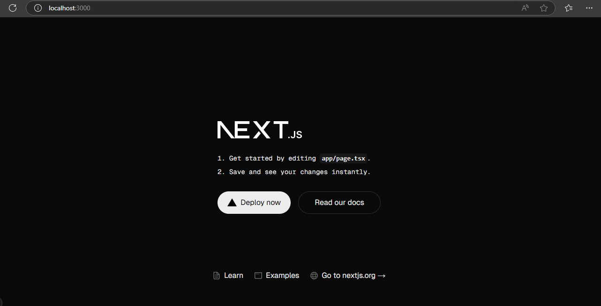

## Praktikum 3: Menambahkan Komponen React (Button)

1. Di dalam folder proyek yang telah dibuka di VS Code, buka file page.tsx

2. Tambahkan fungsi MyButton yang mengembalikan markup komponen button yang akan ditambahkan ke dalam webpage

Hasil:

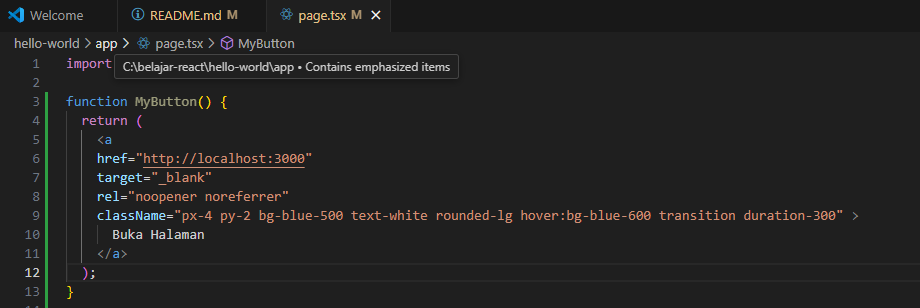

3. Tambahkan komponen button tersebut disamping button Read Out Docs

Hasil:

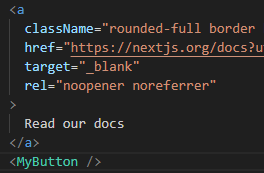

4. Simpan perubahan dan coba lihat perubahan melalui web browser!

Pertanyaan Praktikum 3 
1. Buktikan dengan screenshoot yang menunjukkan bahwa tahapan percobaan di atas telah berhasil Anda lakukan! 

Hasil:

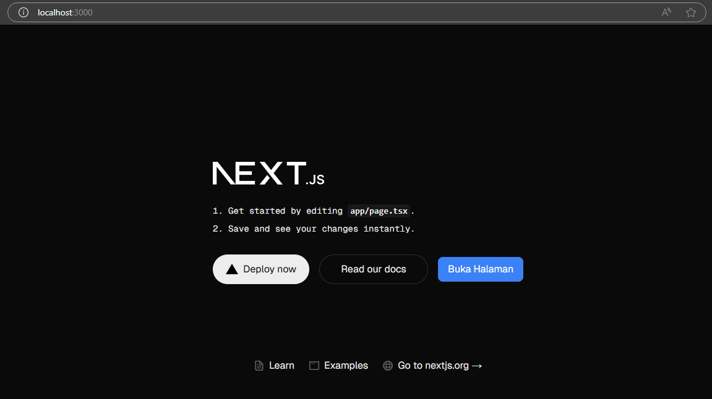

## Praktikum 4: Menulis Markup dengan JSX

1. Tambahkan kode JSX di bawah ini ke dalam file page.tsx.

Hasil:

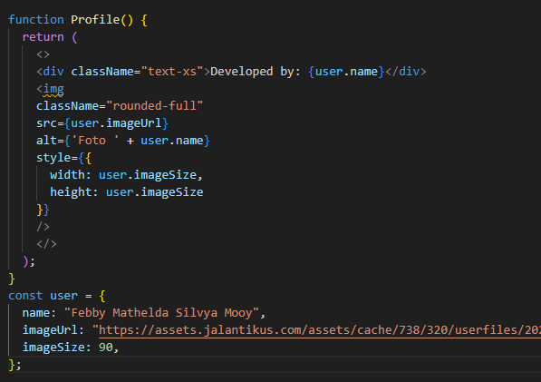

2. Tambahkan komponen MyProfile setelah kompnen MyButton.

Hasil:

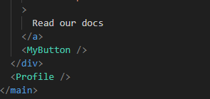

Pertanyaan Praktikum 4 

1. Untuk apakah kegunaan sintaks user.imageUrl? 

Jawab:

Sintaks user.imageUrl digunakan untuk mengakses URL gambar yang tersimpan dalam objek user. 

2. Buktikan dengan screenshoot yang menunjukkan bahwa tahapan percobaan di atas telah 
berhasil Anda lakukan!

Hasil:

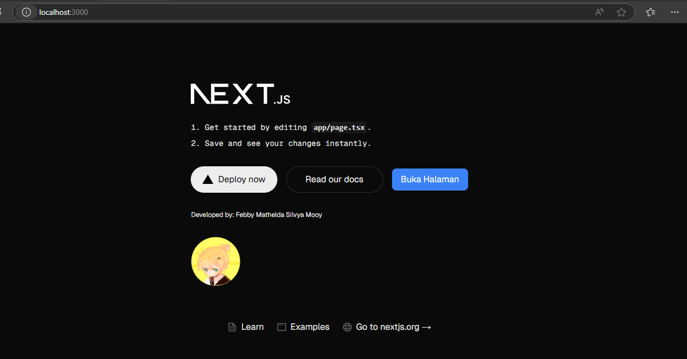